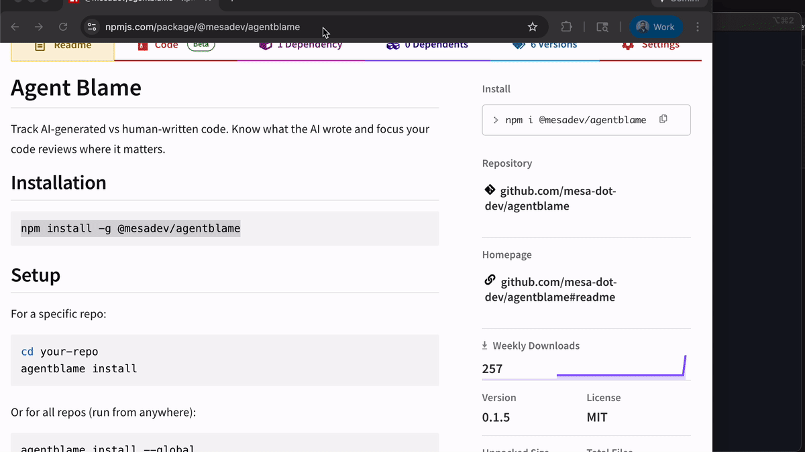
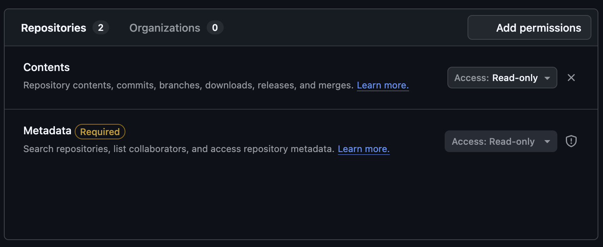
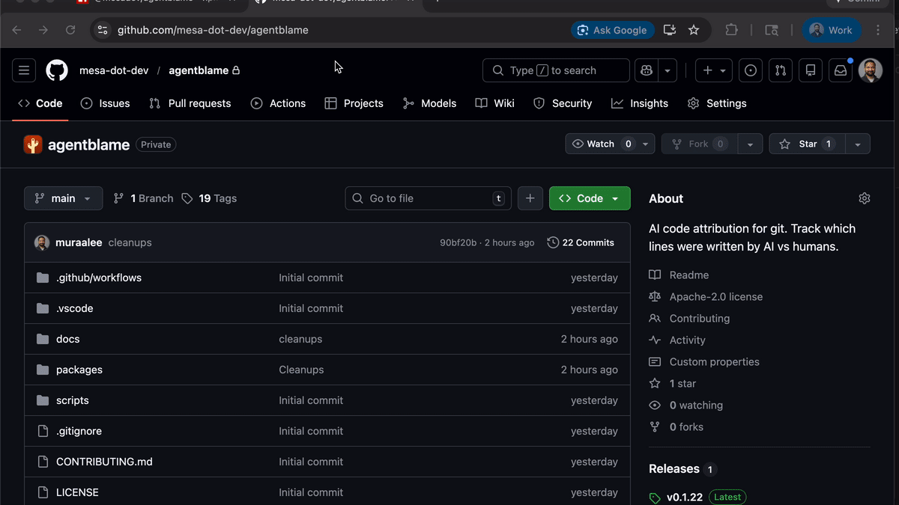

<div align="center">

# Agent Blame

**Know what the AI wrote. Focus your code reviews where it matters.**

[](https://www.npmjs.com/package/@mesadev/agentblame)
[](LICENSE)
[](https://discord.gg/2vvEJFrCHV)

[Quick Start](#quick-start) | [CLI Reference](#cli-reference) | [Squash & Merge Support](#squash--merge-support)
<br>


<sub>Orange markers highlight AI-generated lines in GitHub PRs</sub>

<br>

</div>

---

## What It Does

Agent Blame tracks AI-generated code in your Git history:

- **CLI** - See which lines were written by AI in any file
- **Chrome Extension** - View AI markers directly on GitHub PRs
- **Automatic** - Works silently with Cursor and Claude Code
- **Squash-Safe** - Attribution survives squash and rebase merges

---

## Prerequisites

- [Bun](https://bun.sh/) runtime (required for hooks)
- Git 2.25+
- Cursor or Claude Code

```bash
# Install Bun if you haven't already
curl -fsSL https://bun.sh/install | bash
```

---

## Quick Start

### 1. Install & Set Up

Install the CLI globally
```bash
npm install -g @mesadev/agentblame
```

Then in a git repository run
```bash
agentblame init
```

This sets up everything automatically for your repository:
- Editor hooks for Cursor and Claude Code
- Git post-commit hook for attribution capture
- GitHub Actions workflow for squash/merge support

> **Important:** Restart Cursor/Claude Code after installation.

<br>



<br>

---

### 2. Commit the Workflow

In order preserve attribution across when squash merging you need a custom [GitHub Actions workflow](.github/workflows/agentblame.yml).
You can either copy + paste that into your own repo or rely on the init command to do it for you.

```bash
git add .github/workflows/agentblame.yml
git commit -m "Add Agent Blame workflow for squash/merge support"
git push
```

When you merge a PR with squash/rebase, the original commits are replaced with new ones. The GitHub Actions workflow automatically:

1. Detects the merge type (squash, rebase, or regular merge)
2. Retrieves attribution data from the original PR commits
3. Transfers attribution to the new merge commit(s)
4. Pushes the updated notes to the repository

If you do not want to use a workflow you can manually sync attribution after pulling a squash merge locally:

```bash
git pull origin main
agentblame sync
```

---

### 3. Install Chrome Extension

See AI attribution directly on GitHub Pull Requests.

**Option A: Chrome Web Store (Recommended)**

1. Install from the [Chrome Web Store](https://chromewebstore.google.com/detail/agent-blame/ofldnnppeiicgpmpgkbmipbcnhnbgccp)
2. Click the extension icon and add your [GitHub token](https://github.com/settings/tokens) (needs `repo` scope)

**Option B: Manual Install**

1. Download `agentblame-chrome.zip` from [Releases](https://github.com/mesa-dot-dev/agentblame/releases)
2. Go to `chrome://extensions` and enable **Developer mode**
3. Click **Load unpacked** and select the extracted folder
4. Click the extension icon and add your [GitHub token](https://github.com/settings/tokens) (needs `repo` scope)

**GitHub Token**
You can use either GitHub's Fine Grained Tokens (recommended) or the classic tokens.
1. For Fine Grained Tokens it needs to have access to your repo with the `contents` scope

2. For classic tokens you need to check the `repo` scopes

<br>



<br>

---

### 4. View Attribution

Make AI edits, commit, then view attribution in CLI or GitHub PRs:

```bash
agentblame blame src/auth.ts
```

<br>


<br>

---

## Chrome Extension Features

- AI percentage badge per file
- Sparkle markers on AI-generated lines
- PR summary showing total AI vs human code

---

## CLI Reference

| Command | Description |
|---------|-------------|
| `agentblame init` | Set up hooks and GitHub Actions workflow (current repo) |
| `agentblame clean` | Remove hooks and workflow from current repo |
| `agentblame blame <file>` | Show AI attribution for a file |
| `agentblame blame --summary` | Show summary only |
| `agentblame blame --json` | Output as JSON |
| `agentblame status` | Show pending AI edits |
| `agentblame sync` | Manually transfer notes after squash/rebase |
| `agentblame prune` | Remove old database entries |

---

## How It Works

```
┌─────────────────┐     ┌─────────────────┐     ┌─────────────────┐
│  Cursor/Claude  │────▶│   Git Hooks     │────▶│    Database     │
│   Code edits    │     │  capture edits  │     │  stores pending │
└─────────────────┘     └─────────────────┘     └─────────────────┘
                                                        │
                                                        ▼
┌─────────────────┐     ┌─────────────────┐     ┌─────────────────┐
│   CLI/Chrome    │◀────│   Git Notes     │◀────│  Git Commit     │
│  show markers   │     │  store metadata │     │  triggers match │
└─────────────────┘     └─────────────────┘     └─────────────────┘
```

1. **Hooks** intercept edits from AI coding tools
2. **Database** stores pending attributions with content hashes
3. **Commit** triggers matching of committed lines to pending edits
4. **Git Notes** attach attribution metadata to commits
5. **CLI/Extension** read notes to display markers
6. **GitHub Actions** preserve attribution through squash/rebase merges

---

## Troubleshooting

| Problem | Solution |
|---------|----------|
| Hooks not capturing | Restart Cursor/Claude Code |
| Notes not on GitHub | Run `git push origin refs/notes/agentblame` |
| Squash merge lost attribution | Ensure workflow is committed; run `agentblame sync` locally |
| Bun not found | Install Bun: `curl -fsSL https://bun.sh/install \| bash` |

---

## Contributing
### Prerequisites

- [Bun](https://bun.sh/) v1.0+
- Git

### Setup

```bash
git clone https://github.com/mesa-dot-dev/agentblame.git
cd agentblame
bun install
bun run build
```

### Commands

```bash
bun run build            # Build all
bun run build:cli        # Build CLI only
bun run build:chrome     # Build Chrome extension only
bun run dev <command>    # Run CLI in dev mode (from packages/cli)
bun run fmt              # Format code
bun run lint             # Lint code
```

### Project Structure

```
agentblame/
├── packages/
│   ├── cli/              # CLI tool
│   │   └── src/
│   │       ├── lib/      # Core utilities
│   │       ├── capture.ts
│   │       ├── blame.ts
│   │       ├── sync.ts
│   │       ├── post-merge.ts
│   │       └── index.ts
│   └── chrome/           # Chrome extension
└── docs/                 # Documentation
```

### Publishing

**npm:**
```bash
cd packages/cli && npm publish --otp=YOUR_CODE
```

**Chrome:** Automatically built on GitHub releases.

### Roadmap
Contributions welcome! Here's what we'd love help with:
- Support for other coding agents
  - Opencode
  - VSCode / Copilot
  - Antigravity
  - and more!
- Multi-browser extension support
- Support for JJ VCS
- Capture and store prompts / chain-of-thought for each edit
---

## License

Apache 2.0

---

<div align="center">

Made by [Mesa.dev](https://mesa.dev)

</div>
