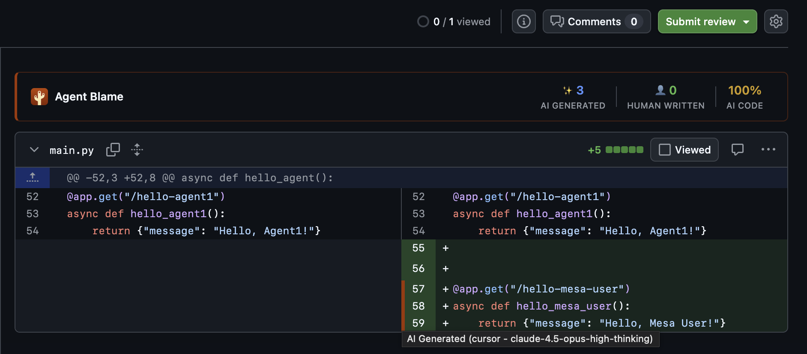
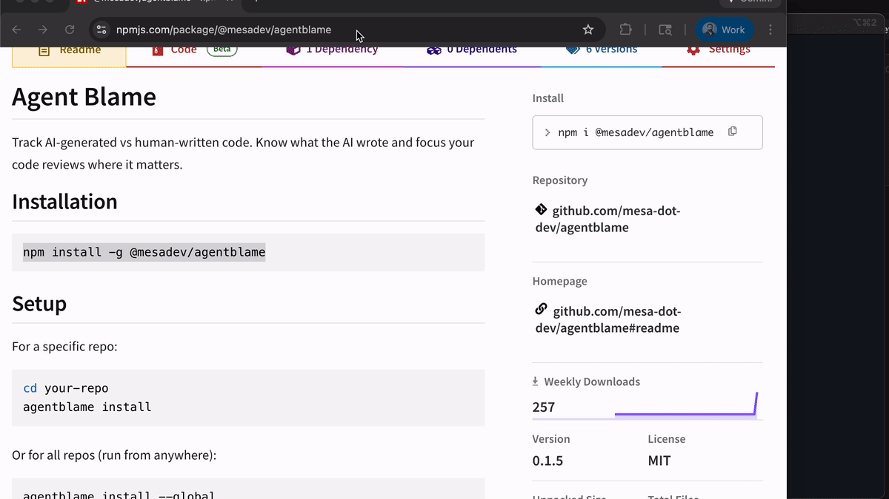
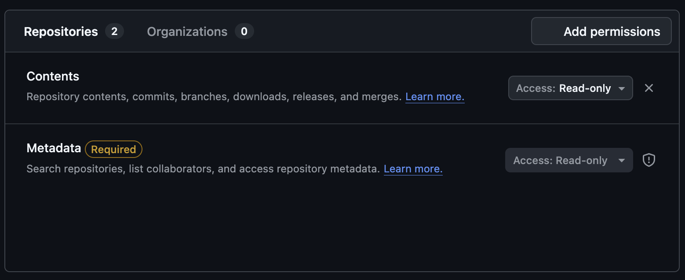
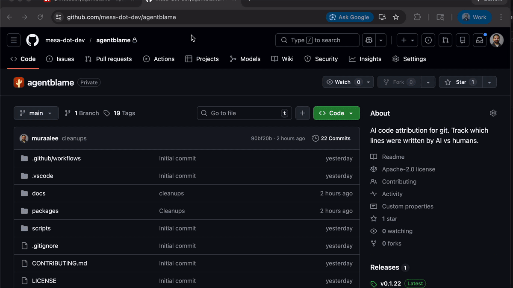
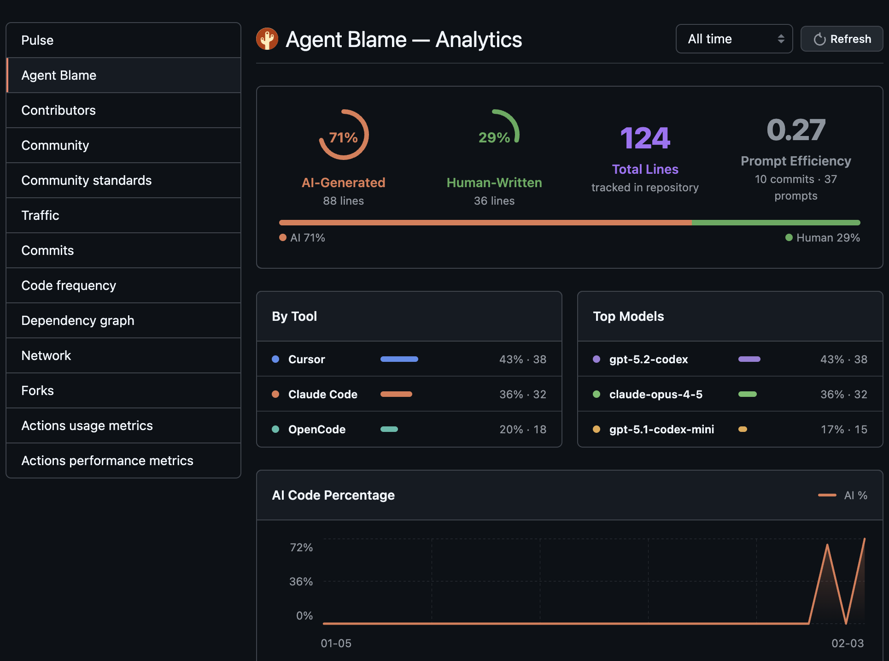

<div align="center">

# Agent Blame

**Know what the AI wrote. Focus your code reviews where it matters.**

[](https://www.npmjs.com/package/@mesadev/agentblame)
[](LICENSE)
[](https://discord.gg/2vvEJFrCHV)

<br>

<a href="https://chromewebstore.google.com/detail/agent-blame/ofldnnppeiicgpmpgkbmipbcnhnbgccp"></a>&nbsp;&nbsp;&nbsp;<a href="https://addons.mozilla.org/en-US/firefox/addon/agent-blame"></a>

[Quick Start](#quick-start) | [Browser Extensions](#browser-extensions) | [CLI Reference](#cli-reference) | [How It Works](#how-it-works)
<br>



<sub>Orange markers highlight AI-generated lines in GitHub PRs</sub>

<br>

</div>

---

## What It Does

Agent Blame tracks AI-generated code in your Git history:

- **CLI** - See which lines were written by AI in any file
- **Browser Extension** - View AI markers directly on GitHub PRs (Chrome & Firefox)
- **Automatic** - Works silently with Cursor, Claude Code, and OpenCode
- **Squash-Safe** - Attribution survives squash and rebase merges

---

## Prerequisites

- [Bun](https://bun.sh/) runtime (required for hooks)
- Git 2.25+
- Cursor, Claude Code, or OpenCode

```bash
# Install Bun if you haven't already
curl -fsSL https://bun.sh/install | bash
```

---

## Quick Start

### 1. One-Time Machine Setup

Run this once on your machine to create the local database and the `ab` shorthand:
```bash
bunx @mesadev/agentblame@latest setup
```
> After setup, restart your terminal. You can now use `ab` instead of `bunx @mesadev/agentblame@latest` for all commands.

### 2. Repository Setup

In each git repository you want to track:
```bash
ab init
```

This sets up everything automatically for your repository:
- Editor hooks for Cursor, Claude Code, and OpenCode
- Git post-commit hook for attribution capture
- GitHub Actions workflow for squash/merge support

> **Important:** Restart your editor after running `ab init`.

<br>



<br>

---

### 3. Commit the Config Files

Commit the generated config files so your team gets the hooks:

```bash
git add .cursor/ .claude/ .opencode/ .github/
git commit -m "Add Agent Blame hooks and workflow"
git push
```

---

### 4. Install Browser Extension

See AI attribution directly on GitHub Pull Requests.

- **Chrome** - [Chrome Web Store](https://chromewebstore.google.com/detail/agent-blame/ofldnnppeiicgpmpgkbmipbcnhnbgccp)
- **Firefox** - [Firefox Add-ons](https://addons.mozilla.org/en-US/firefox/addon/agentblame/)

After installing, click the extension icon and add your GitHub token.

**GitHub Token**

You can use either Fine Grained Tokens (recommended) or Classic Tokens:

| Token Type | Where to Create | Required Scope |
|------------|-----------------|----------------|
| Fine Grained (recommended) | [Settings → Fine-grained tokens](https://github.com/settings/tokens?type=beta) | `contents: read` for your repo |
| Classic | [Settings → Tokens (classic)](https://github.com/settings/tokens) | `repo` scope |



<br>



<br>

---

### 5. View Attribution

Make AI edits, commit, then view attribution in CLI or GitHub PRs:

```bash
ab blame src/auth.ts
```

<br>


<br>

---

## Browser Extensions

### PR Attribution

<!-- TODO: Add screenshot -->


<br>

- **PR summary** at the top of every PR showing AI-generated vs human-written line counts and overall AI percentage
- **File-level badges** in the diff header for each file
- **Line-level gutter markers** that highlight AI-generated lines in orange
- **Hover details** on any gutter marker showing the tool, model, and prompt used to generate that code

### Analytics Dashboard

Full repository-wide analytics, accessible from the **Insights** sidebar on any GitHub repository.

<!-- TODO: Add screenshot -->


<br>

- **Summary stats** showing AI vs human percentages, total lines tracked, and commit-to-prompt ratio
- **Tool breakdown** showing which AI tools (Cursor, Claude Code, OpenCode, etc.) generated the most code
- **Model breakdown** with the top models used across the repository
- **Trend charts** for AI code percentage, prompt efficiency, tool usage, and model usage over time
- **Time period filtering** to slice all metrics by past 24 hours, 3 days, week, month, or all time
- **Per-contributor stats** with AI usage percentage, commit-to-prompt ratio, and line counts
- **Recent PR activity** listing the latest PRs with AI attribution badges and diff stats

---

## CLI Reference

> **First run:** `bunx @mesadev/agentblame@latest setup` — this creates the database and adds the `ab` shell alias. After restarting your terminal, use `ab` for all commands below.

| Command | Description |
|---------|-------------|
| `bunx @mesadev/agentblame@latest setup` | One-time machine setup (creates database + `ab` alias) |
| `ab init` | Set up hooks and GitHub Actions workflow for a repo |
| `ab status` | Show tracking stats for current repo |
| `ab blame <file>` | Show AI attribution for a file |
| `ab sync` | Transfer notes after squash/rebase |
| `ab config` | Show/set configuration |
| `ab debug` | Show detailed debug info |

---

## How It Works

```
┌─────────────────┐     ┌─────────────────┐     ┌─────────────────┐
│  Cursor/Claude  │────▶│   Git Hooks     │────▶│    Database     │
│   Code edits    │     │  capture edits  │     │  stores pending │
└─────────────────┘     └─────────────────┘     └─────────────────┘
                                                        │
                                                        ▼
┌─────────────────┐     ┌─────────────────┐     ┌─────────────────┐
│  CLI/Extension  │◀────│   Git Notes     │◀────│  Git Commit     │
│  show markers   │     │  store metadata │     │  triggers match │
└─────────────────┘     └─────────────────┘     └─────────────────┘
```

1. **Hooks** intercept edits from AI coding tools
2. **Database** stores pending attributions with content hashes
3. **Commit** triggers matching of committed lines to pending edits
4. **Git Notes** attach attribution metadata to commits
5. **CLI/Extension** read notes to display markers
6. **GitHub Actions** preserve attribution through squash/rebase merges

---

## Troubleshooting

| Problem | Solution |
|---------|----------|
| Database not found | Run `bunx @mesadev/agentblame@latest setup` once on your machine |
| Hooks not capturing | Restart your editor; run `ab debug` to check status |
| Notes not on GitHub | Run `git push origin refs/notes/agentblame` |
| Squash merge lost attribution | Ensure workflow is committed; run `ab sync` locally |
| Bun not found | Install Bun: `curl -fsSL https://bun.sh/install \| bash` |

---

## Contributing
### Prerequisites

- [Bun](https://bun.sh/) v1.0+
- Git

### Setup

```bash
git clone https://github.com/mesa-dot-dev/agentblame.git
cd agentblame
bun install
bun run build
```

### Commands

```bash
bun run build            # Build all
bun run build:cli        # Build CLI only
bun run build:chrome     # Build Chrome extension
bun run build:firefox    # Build Firefox extension
bun run dev <command>    # Run CLI in dev mode (from packages/cli)
bun run fmt              # Format code
bun run lint             # Lint code
```

### Project Structure

```
agentblame/
├── packages/
│   ├── cli/              # CLI tool (@mesadev/agentblame)
│   ├── extension/        # Shared browser extension source
│   ├── chrome/           # Chrome extension build
│   └── firefox/          # Firefox extension build
└── docs/                 # Documentation
```

### Publishing

**npm:**
```bash
cd packages/cli && npm publish --otp=YOUR_CODE
```

**Chrome:** Automatically built on GitHub releases.

### Roadmap
Contributions welcome! Here's what we'd love help with:
- Support for other coding agents
  - VSCode / Copilot
  - Windsurf
  - Zed
  - and more!
- Support for JJ VCS
---

## License

Apache 2.0

---

<div align="center">

Made by [Mesa.dev](https://mesa.dev)

</div>
